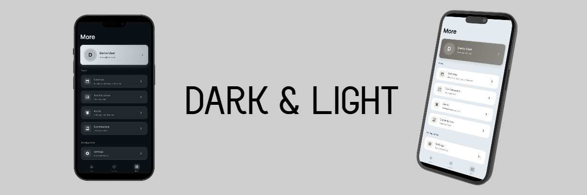

<div style="display: flex; align-items: center; gap: 16px;">
  

  <div>
    <h1>Flutter Clean Architecture Boilerplate</h1>
  </div>
</div>

<p>
  Production-grade Flutter boilerplate with Clean Architecture, Riverpod, GetIt, and complete authentication UI. Backend integration ready.
</p>



<br>

> [!NOTE]
> This is a **UI-ready boilerplate**. The authentication screens and flows are fully implemented with professional architecture patterns, but require connecting to your own backend API. All the infrastructure is in place. Just plug in your endpoints.

## 📋 Table of Contents

- [Features](#-features)
- [Architecture](#-architecture)
- [Getting Started](#-getting-started)
- [Project Structure](#-project-structure)
- [How to Use This Boilerplate](#-how-to-use-this-boilerplate)
- [Adding New Features](#-adding-new-features)
- [Customization](#-customization)

## ✨ Features

### Core Features
- ✅ **Clean Architecture** - Separation of concerns with domain/data/presentation layers
- ✅ **Dependency Injection** - GetIt for testable and modular code
- ✅ **State Management** - Riverpod with code generation
- ✅ **Routing** - GoRouter with authentication guards
- ✅ **Internationalization** - Multi-language support (EN/ES included)
- ✅ **Theme System** - Dark/Light mode with customizable colors
- ✅ **HTTP Client** - Dio with interceptors and automatic token refresh
- ✅ **Local Storage** - Flutter Secure Storage + Hive
- ✅ **Error Handling** - Centralized error handling with custom codes
- ✅ **Testing** - Unit and widget tests with Mockito

### Included Features (Reference Implementations)

**Authentication** - Complete auth system with:
- ✅ Login/Register with email verification
- ✅ Two-Factor Authentication (2FA/TOTP)
- ✅ Password reset with email codes
- ✅ Session management
- ✅ Activity log
- ✅ Account deletion

**Settings** - User preferences and app configuration:
- ✅ App preferences (theme, language, notifications)
- ✅ Profile editing
- ✅ Security settings

**Notifications** - Push notifications system:
- ✅ Local notifications
- ✅ Notification settings
- ✅ Scheduled notifications

### UI Components
- ✅ Loading indicators (6 variants)
- ✅ Skeleton loaders
- ✅ Empty states
- ✅ Toast notifications
- ✅ Confirmation dialogs
- ✅ Custom transitions

 

## 🏗️ Architecture

This boilerplate follows **Clean Architecture** principles:

```
lib/
├── core/                              # Shared code
│   ├── config/                        # App configuration (Dio, interceptors)
│   ├── constants/                     # App constants
│   ├── di/                           # Dependency Injection setup
│   ├── l10n/                         # Internationalization
│   ├── router/                       # Navigation (GoRouter)
│   ├── services/                     # Core services (storage, notifications)
│   ├── theme/                        # Theme configuration
│   ├── utils/                        # Utilities (formatters, validators)
│   └── widgets/                      # Reusable widgets
│
└── features/                          # Feature modules
    └── [feature_name]/
        ├── data/
        │   ├── datasources/          # Remote/Local data sources
        │   ├── models/               # Data models (JSON serialization)
        │   └── repositories/         # Repository implementations
        ├── domain/
        │   ├── entities/             # Business objects
        │   ├── repositories/         # Repository interfaces
        │   └── usecases/            # Business logic
        └── presentation/
            ├── providers/            # State management
            ├── screens/              # UI screens
            └── widgets/              # Feature-specific widgets
```

### Data Flow

```
UI (Widgets)
  ↓
State Management (Riverpod Providers)
  ↓
Use Cases (Business Logic)
  ↓
Repository Interface (Contract)
  ↓
Repository Implementation
  ↓
Data Sources (Remote/Local)
```

 

## 🎯 Getting Started

### Prerequisites
- Flutter SDK >=3.9.2
- Dart SDK
- IDE (VS Code or Android Studio)

### Installation

1. **Clone or copy this boilerplate**
   ```bash
   cp -r flutter-clean-architecture-boilerplate my-new-project
   cd my-new-project
   ```

2. **Rename the project manually**
   - Update `name` in `pubspec.yaml`
   - Update `applicationId` in `android/app/build.gradle`
   - Update `PRODUCT_BUNDLE_IDENTIFIER` in `ios/Runner.xcodeproj/project.pbxproj`
   - Update import statements in all Dart files

3. **Install dependencies**
   ```bash
   flutter pub get
   ```

4. **Generate code**
   ```bash
   flutter pub run build_runner build --delete-conflicting-outputs
   ```

5. **Run the app**
   ```bash
   flutter run
   ```

6. **Try Demo Mode** (optional)

   The app includes a demo mode to explore the UI without a backend:
   - Email: `demo@test.com`
   - Password: `demo123`

   This allows you to test the authentication flow and explore all screens with mock data.

 

## 📁 Project Structure

### Core Directory

#### `core/config/`
- **`dio_client.dart`** - HTTP client configuration with interceptors
- **`auth_interceptor.dart`** - Automatic token refresh logic

#### `core/di/`
- **`injection_container.dart`** - Dependency injection setup
  - Register all services, repositories, and use cases here

#### `core/l10n/`
- **`app_localizations.dart`** - Localization interface
- **`app_localizations_en.dart`** - English translations
- **`app_localizations_es.dart`** - Spanish translations

#### `core/router/`
- **`app_router.dart`** - GoRouter configuration with guards
- **`page_transitions.dart`** - Custom page transitions

#### `core/theme/`
- **`app_theme.dart`** - Complete theme configuration
  - Change colors here to rebrand the app

#### `core/widgets/`
- Reusable UI components
- Loading indicators, skeleton loaders, empty states

### Features Directory

This boilerplate includes the following features ready to use:

#### `features/auth/` - Complete Authentication System

**Domain Layer (Business Logic)**
- `entities/` - Pure Dart objects (User, Session, etc.)
- `repositories/` - Abstract interfaces
- `usecases/` - Business logic (LoginUseCase, RegisterUseCase, etc.)

**Data Layer (Data Handling)**
- `datasources/` - API calls (AuthRemoteDataSource)
- `models/` - JSON serialization (extends entities)
- `repositories/` - Repository implementations

**Presentation Layer (UI)**
- `providers/` - Riverpod state management
- `screens/` - UI screens
- `widgets/` - Feature-specific widgets

#### `features/settings/` - User Settings & Preferences
- App preferences (theme, language, notifications)
- Profile editing
- Security settings
- Account management

#### `features/notifications/` - Push Notifications
- Local notifications system
- Notification settings
- Scheduled notifications

#### `features/home/` - Main Navigation
- Welcome screen
- Main layout with bottom navigation
- Dashboard (customize for your app)

#### `features/more/` - Menu & Settings
- Settings menu
- App information
- About screen

#### `features/splash/` - Splash Screen
- Initial loading screen
- App initialization

 

## 🆕 Adding New Features

### Step 1: Create Feature Structure

```bash
lib/features/my_feature/
├── data/
│   ├── datasources/
│   │   └── my_feature_remote_datasource.dart
│   ├── models/
│   │   └── my_model.dart
│   └── repositories/
│       └── my_feature_repository_impl.dart
├── domain/
│   ├── entities/
│   │   └── my_entity.dart
│   ├── repositories/
│   │   └── my_feature_repository.dart
│   └── usecases/
│       └── get_my_data_usecase.dart
└── presentation/
    ├── providers/
    │   └── my_feature_provider.dart
    ├── screens/
    │   └── my_feature_screen.dart
    └── widgets/
        └── my_feature_widget.dart
```

### Step 2: Implement Domain Layer

**1. Create Entity** (`domain/entities/my_entity.dart`)
```dart
class MyEntity {
  final String id;
  final String name;

  const MyEntity({required this.id, required this.name});
}
```

**2. Create Repository Interface** (`domain/repositories/my_feature_repository.dart`)
```dart
abstract class MyFeatureRepository {
  Future<List<MyEntity>> getAll();
  Future<MyEntity> getById(String id);
}
```

**3. Create Use Case** (`domain/usecases/get_my_data_usecase.dart`)
```dart
class GetMyDataUseCase {
  final MyFeatureRepository repository;

  const GetMyDataUseCase(this.repository);

  Future<List<MyEntity>> call() async {
    return await repository.getAll();
  }
}
```

### Step 3: Implement Data Layer

**1. Create Model** (`data/models/my_model.dart`)
```dart
import '../../domain/entities/my_entity.dart';

class MyModel extends MyEntity {
  const MyModel({required super.id, required super.name});

  factory MyModel.fromJson(Map<String, dynamic> json) {
    return MyModel(
      id: json['id'],
      name: json['name'],
    );
  }

  Map<String, dynamic> toJson() {
    return {'id': id, 'name': name};
  }
}
```

**2. Create Data Source** (`data/datasources/my_feature_remote_datasource.dart`)
```dart
abstract class MyFeatureRemoteDataSource {
  Future<List<MyModel>> getAll();
}

class MyFeatureRemoteDataSourceImpl implements MyFeatureRemoteDataSource {
  final Dio dio;

  MyFeatureRemoteDataSourceImpl({required this.dio});

  @override
  Future<List<MyModel>> getAll() async {
    final response = await dio.get('/api/my-feature');
    return (response.data as List)
        .map((json) => MyModel.fromJson(json))
        .toList();
  }
}
```

**3. Create Repository Implementation** (`data/repositories/my_feature_repository_impl.dart`)
```dart
class MyFeatureRepositoryImpl implements MyFeatureRepository {
  final MyFeatureRemoteDataSource remoteDataSource;

  MyFeatureRepositoryImpl({required this.remoteDataSource});

  @override
  Future<List<MyEntity>> getAll() async {
    return await remoteDataSource.getAll();
  }
}
```

### Step 4: Register in DI Container

Update `core/di/injection_container.dart`:

```dart
// Data sources
sl.registerLazySingleton<MyFeatureRemoteDataSource>(
  () => MyFeatureRemoteDataSourceImpl(dio: sl()),
);

// Repositories
sl.registerLazySingleton<MyFeatureRepository>(
  () => MyFeatureRepositoryImpl(remoteDataSource: sl()),
);

// Use cases
sl.registerLazySingleton(() => GetMyDataUseCase(sl()));
```

### Step 5: Create Provider

```dart
import 'package:riverpod_annotation/riverpod_annotation.dart';
import '../../../core/di/injection_container.dart';

part 'my_feature_provider.g.dart';

@riverpod
class MyFeature extends _$MyFeature {
  @override
  FutureOr<List<MyEntity>> build() async {
    final useCase = sl<GetMyDataUseCase>();
    return await useCase();
  }

  Future<void> refresh() async {
    state = const AsyncLoading();
    state = await AsyncValue.guard(() async {
      final useCase = sl<GetMyDataUseCase>();
      return await useCase();
    });
  }
}
```

Generate provider:
```bash
flutter pub run build_runner build
```

### Step 6: Create UI

```dart
class MyFeatureScreen extends ConsumerWidget {
  const MyFeatureScreen({super.key});

  @override
  Widget build(BuildContext context, WidgetRef ref) {
    final dataState = ref.watch(myFeatureProvider);

    return Scaffold(
      appBar: AppBar(title: const Text('My Feature')),
      body: dataState.when(
        data: (data) => ListView.builder(
          itemCount: data.length,
          itemBuilder: (context, index) {
            final item = data[index];
            return ListTile(title: Text(item.name));
          },
        ),
        loading: () => const ElegantLoadingIndicator(),
        error: (error, stack) => Center(child: Text('Error: $error')),
      ),
    );
  }
}
```

 

## 🎨 Customization

### Change Theme Colors

Edit `lib/core/theme/app_theme.dart`:

```dart
// Change these colors to rebrand the app
static const Color color1 = Color(0xFF2D2D2D);  // Your primary color
static const Color color2 = Color(0xFF3A3A3A);  // Your secondary color
// ... etc
```

### Add New Language

1. Create `lib/core/l10n/app_localizations_fr.dart`:
```dart
class AppLocalizationsFr implements AppLocalizations {
  @override
  String get login => 'Connexion';
  // ... translate all strings
}
```

2. Update `app_localizations.dart`:
```dart
static const List<Locale> supportedLocales = [
  Locale('en', 'US'),
  Locale('es', 'ES'),
  Locale('fr', 'FR'),  // Add new locale
];
```

3. Update the delegate:
```dart
@override
Future<AppLocalizations> load(Locale locale) async {
  switch (locale.languageCode) {
    case 'es': return AppLocalizationsEs();
    case 'fr': return AppLocalizationsFr();  // Add case
    case 'en':
    default: return AppLocalizationsEn();
  }
}
```

### Update API Base URL

Edit `lib/core/constants/app_constants.dart`:

```dart
static const String baseUrl = 'https://your-api.com/api';
```


## 📖 Additional Resources

- [Flutter Clean Architecture Guide](https://resocoder.com/2019/08/27/flutter-tdd-clean-architecture-course-1-explanation-project-structure/)
- [Riverpod Documentation](https://riverpod.dev/)
- [GetIt Documentation](https://pub.dev/packages/get_it)
- [GoRouter Documentation](https://pub.dev/packages/go_router)
- [Dio Documentation](https://pub.dev/packages/dio)


## 🤝 Contributing

When extending this boilerplate:

1. Follow the existing architecture patterns
2. Write tests for new features
3. Update documentation
4. Use consistent naming conventions
5. Keep core/ generic and reusable


## 📄 License

This boilerplate is free to use for any project, commercial or personal.

